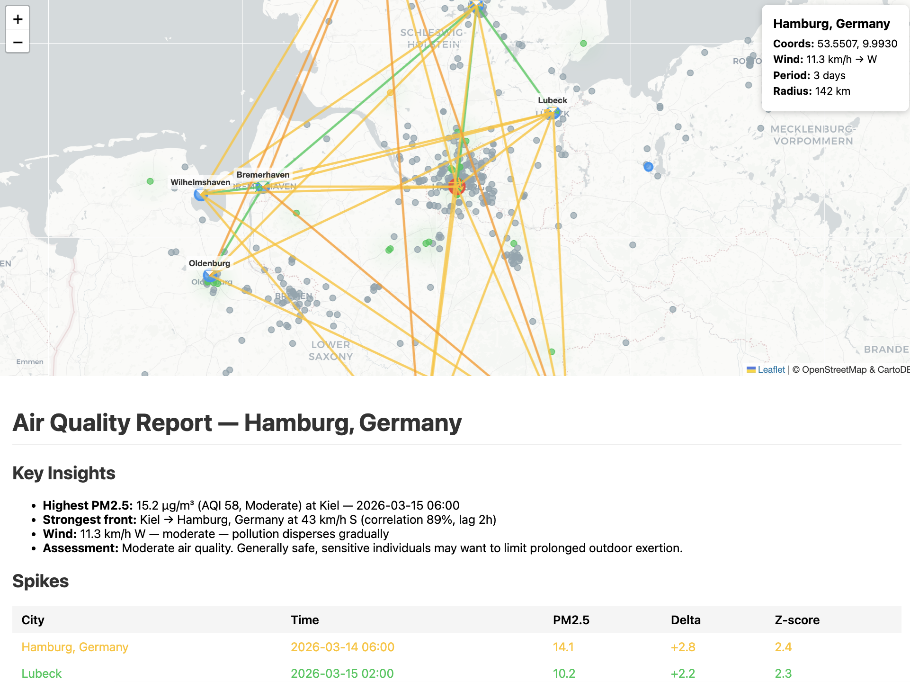

# airq

[](https://crates.io/crates/airq)
[](https://crates.io/crates/airq-core)
[](LICENSE)

Check air quality from your terminal. Any city in the world, no API key needed. Detects pollution fronts, generates visual reports with maps and heatmaps.



*Pollution front analysis for Hamburg — 522 sensors, cross-correlation tracking, heatmap overlay. Generated with `airq report --city hamburg --radius 150 --pdf`*

Merges two data sources with dynamic weighting by divergence:
- **Sensor.Community** — citizen science sensors (15,000+ real sensors worldwide) — **primary, ground truth**
- **Open-Meteo** — CAMS atmospheric model (PM2.5, PM10, CO, NO2, O3, SO2, UV) — **fallback**

When sources diverge (e.g. model says 130, sensors say 7), sensors win. Model weight drops to ~0% at high divergence.

## Install

```bash
brew install fortunto2/tap/airq     # Homebrew (macOS & Linux)
cargo install airq                  # crates.io (any platform)
```

Or download prebuilt binaries from [GitHub Releases](https://github.com/fortunto2/airq/releases).

## Air Signal Desktop


*Air Signal desktop app — Berlin: 288 sensors, comfort score 66, CO/NO2/O3 WHO status, live sensor table.*

Native desktop app for real-time air quality monitoring. Single binary, no Docker, no browser.

```bash
cargo run -p airq-dashboard     # from source
# or download air-signal binary from Releases
```

**Features:**
- **Dashboard** — PM2.5/PM10 stats, comfort score, CO/NO2/O3 WHO status, sensor table
- **Map** — Leaflet with heatmap overlay, layer switcher (dark/OSM/light), city radius
- **Comfort** — 6-signal matrix table (Air, Temp, Wind, UV, Pressure, Humidity) with progress bars
- **Events** — pollution event timeline with source classification
- **Sources** — PM10/PM2.5 ratio guide, extended pollutants grid
- **Network** — local WiFi/VPN IPs, Start/Stop HTTP server, LAN sensor scan (ESP8266)
- **Settings** — editable config, save to `config.toml` (shared with CLI)

**City switching** — click chips in top bar or type in search (40K city autocomplete). Data updates immediately.

**Two modes:**
| Mode | Binary | Use case |
|------|--------|----------|
| Desktop app | `air-signal` | Local monitoring with GUI |
| Headless daemon | `airq serve` | Server, MCP, remote access |

Both share the same SQLite DB and config.

### Headless server

```bash
airq serve --city gazipasa --radius 15 --port 8080
airq serve --city moscow --city istanbul --interval 600
```

REST API + Swagger UI at `http://localhost:8080/docs/`:
- `GET /api/status` — uptime, sensor/reading counts
- `GET /api/readings?sensor=X&from=Y&to=Z` — sensor readings
- `GET /api/sensors` — sensor list
- `GET /api/events` — detected pollution events
- `GET /api/cities` — configured cities
- `POST /api/push` — ESP8266/ESP32 data ingestion

### ESP8266 sensor setup

Configure your airRohr/Sensor.Community sensor to push data:
- Server: `<your-ip>` (shown in Network tab)
- Path: `/api/push`
- Port: `8080`

### Install as daemon

**macOS:**
```bash
# Create ~/Library/LaunchAgents/com.airsignal.serve.plist
launchctl load ~/Library/LaunchAgents/com.airsignal.serve.plist
```

**Linux:**
```bash
# Create ~/.config/systemd/user/air-signal.service
systemctl --user enable --now air-signal
```

**Windows:**
```bash
nssm install AirSignal airq.exe serve --city gazipasa
nssm start AirSignal
```

## Quick start

```bash
airq --city gazipasa
```

```
Resolved city: Gazipaşa, Türkiye
Sources: Open-Meteo (model) + Sensor.Community (1 sensors, 5km median)
--------------------------------------------------
PM2.5  9.6 avg  (12.7 model, 6.5 sensors) μg/m³
PM10   14.7 avg  (16.2 model, 13.1 sensors) μg/m³
CO    159.0 μg/m³
NO2   1.9 μg/m³
O3    73.0 μg/m³
SO2   1.1 μg/m³
UV Index: 0 ☀️ (Low)
Humidity: 59% | Pressure: 1009 hPa (normal)
Wind:   5.2 km/h ↙ NE (gusts 8)
Comfort: 90/100 🟢 Excellent
--------------------------------------------------
🟢 US AQI: 40 | EU AQI: 29 — Good
```

## Commands

### Any city in the world

```bash
airq --city tokyo
airq --city "new york"
airq --city berlin
airq --city анталья
```

### By coordinates

```bash
airq --lat 55.75 --lon 37.62
```

### Comfort index

```bash
airq comfort --city berlin
```

```
Berlin, Germany — Comfort Index: 67/100 — Good

  Air Quality   80/100  ████████░░  AQI 38 (Good)
  Temperature   21/100  ██░░░░░░░░  2°C
  Wind          80/100  ████████░░  17 km/h SW
  UV           100/100  ██████████  0.6 (Low)
  Pressure      84/100  ████████░░  1005 hPa
  Humidity      75/100  ███████░░░  74%
```

### Extended data (pollen, earthquakes, geomagnetic)

```bash
airq --city gazipasa --full
```

Shows additional data only when significant:
- Pollen levels (grass, birch, alder, ragweed)
- Nearby earthquakes (M3+, 200km, 7 days)
- Geomagnetic Kp index (when unsettled/storm)

### History (sparkline)

```bash
airq history --city istanbul --days 5
```

```
Istanbul, Türkiye — last 5 days
2026-03-09: ██░░░ 10.9 µg/m³ (AQI 44 🟢)
2026-03-10: ███░░ 20.7 µg/m³ (AQI 57 🟡)
2026-03-11: ███░░ 21.5 µg/m³ (AQI 68 🟡)
2026-03-12: ███░░ 17.3 µg/m³ (AQI 68 🟡)
2026-03-13: ███░░ 20.3 µg/m³ (AQI 64 🟡)
```

### Top cities by AQI

```bash
airq top --country turkey
airq top --country russia --count 10
airq top --country usa --json
```

```
# City              AQI  PM2.5
1 Delhi             210  🟣 58.9
2 Mumbai            87   🟡 29.3
3 Bangalore         62   🟡 17.5
4 Chennai           54   🟡 13.7
5 Kolkata           43   🟢 10.2
```

Any country in the world — 10,000+ cities built-in. Use `airq top --country x --list` to see all.

### Compare providers

```bash
airq compare --city berlin                       # area median (all sensors in 5km)
airq compare --city gazipasa --sensor-id 77955   # specific sensor
```

```
Berlin, Germany — Provider Comparison
Sensor.Community: 143 sensors, 5km radius
┌──────────┬───────────┬─────────────────┬─────────┐
│ Metric   │ Open-Meteo│     Area Median │ Average │
├──────────┼───────────┼─────────────────┼─────────┤
│ PM2.5    │       4.2 │             6.8 │     5.5 │
│ PM10     │       5.3 │            11.1 │     8.2 │
│ US AQI   │        31 │       28 (calc) │      29 │
└──────────┴───────────┴─────────────────┴─────────┘
```

### Single provider

```bash
airq --city berlin --provider open-meteo          # model only
airq --city berlin --provider sensor-community --sensor-id 72203  # sensor only
```

### JSON output

All commands support `--json`:

```bash
airq --city berlin --json
airq history --city tokyo --days 7 --json
airq top --country usa --json
airq compare --city berlin --json
```

### Pollution front detection

Detect pollution fronts moving between cities using cross-correlation analysis:

```bash
airq front --city gazipasa --radius 150 --days 3
```

```
Analyzing pollution fronts around Gazipaşa, Türkiye...
Nearby cities (150km radius):
  Alanya (42km NW), Manavgat (97km NW), Karaman (129km NE)...

Current wind: 5.2 km/h ↙ NE

Spike detection (last 72h):
  🟡 Alanya: 16.8 µg/m³ (+2.6) 2026-03-15 20:00
  🟢 Manavgat: 12.0 µg/m³ (+2.0) 2026-03-15 20:00

Pollution fronts detected:
  ↘ Manavgat → Gazipaşa | 5 km/h SE | lag 20h | corr 87%
  ⚠ Manavgat → Gazipaşa front detected (lag 20h, 5 km/h)
```

Uses Z-score spike detection, cross-correlation with time-lag, and haversine geometry to track pollution movement.

### HTML report with map

Generate a visual report with Leaflet.js map showing cities, front arrows, and analysis tables:

```bash
airq report --city hamburg --radius 150 --days 3         # HTML only
airq report --city hamburg --radius 150 --days 3 --pdf   # HTML + PDF
```

Opens in any browser. For PDF export (`--pdf`) you need one of:
- **Google Chrome** (recommended) — already installed on most systems, used in headless mode
- **wkhtmltopdf** — lightweight alternative:
  ```bash
  brew install wkhtmltopdf        # macOS
  sudo apt install wkhtmltopdf    # Ubuntu/Debian
  ```

### Pollution source attribution (blame)

Identify which factories, power plants, or highways contribute to local air pollution:

```bash
airq blame --city hamburg --radius 20 --days 7
```

Auto-discovers factories, power plants, and highways from OpenStreetMap (Overpass API). CPF = probability that high PM2.5 occurs when wind blows from that source direction. Custom sources in config:

```toml
[[sources]]
name = "My Local Factory"
lat = 55.82
lon = 37.73
source_type = "factory"
```

The `report` command includes blame data too — source markers on the map and CPF table in the PDF.

### Find nearby sensors

```bash
airq nearby --city gazipasa --radius 10
```

## Configuration

Set up a default city and favorites list so you don't have to type `--city` every time:

```bash
airq init --city tokyo          # set default city
airq                            # now just works — uses tokyo
```

Config file: `~/.config/airq/config.toml`

```toml
default_city = "tokyo"
cities = ["tokyo", "berlin", "istanbul", "new york"]
```

With a favorites list, check all cities at once:

```bash
airq --all
```

```
# City              AQI  PM2.5
1 Istanbul          98   🟡 34.6
2 New York          72   🟡 22.0
3 Berlin            31   🟢 4.2
4 Tokyo             35   🟢 8.3
```

## How it works

By default (`--provider all`), airq fetches both sources in parallel and averages PM2.5/PM10. Each value shows the breakdown:

```
PM2.5  4.9 avg  (4.2 model, 5.7 sensors) μg/m³
```

- **model** = Open-Meteo CAMS atmospheric forecast (global, ~11km grid) — can be inaccurate for some regions
- **sensors** = median of all Sensor.Community sensors within 5km — real measurements, ground truth

When both available, dynamic merge weights sensors higher. If model diverges >5x from sensors, model is ignored. If no sensors nearby, falls back to model only.

## AQI scale

| AQI | Category | Color |
|-----|----------|-------|
| 0–50 | Good | 🟢 |
| 51–100 | Moderate | 🟡 |
| 101–150 | Unhealthy for Sensitive Groups | 🟠 |
| 151–200 | Unhealthy | 🔴 |
| 201–300 | Very Unhealthy | 🟣 |
| 301–500 | Hazardous | 🟤 |

US AQI from Open-Meteo API. EU AQI also shown. For sensor-only data, AQI calculated using EPA formula.

## Front detection methodology

The `front` and `report` commands use cross-correlation analysis to detect pollution movement:

1. **Spike detection** — Z-score on hourly PM2.5 differences. Flags sudden changes (z > 2σ)
2. **Cross-correlation** — compares time-series between city/sensor pairs with lags -24h to +24h. Peak correlation reveals transit time
3. **Speed & direction** — haversine distance / time lag = front speed. Bearing calculated from coordinates
4. **Dual-source** — when both Open-Meteo (model) and Sensor.Community (ground sensors) are available, correlations are weighted and merged. Agreement boosts confidence
5. **Sensor clustering** — nearby sensors (~5km) are grouped into zones for spatial analysis. Reports show individual sensor locations with PM2.5 heatmap overlay

See [examples/](examples/) for sample reports.

## Data sources

All free, no API keys needed:

- [Open-Meteo Air Quality API](https://open-meteo.com/en/docs/air-quality-api) — PM2.5, PM10, CO, NO2, O3, SO2, pollen, AQI
- [Open-Meteo Weather API](https://open-meteo.com/en/docs) — wind, pressure, humidity, temperature, UV
- [Open-Meteo Geocoding API](https://open-meteo.com/en/docs/geocoding-api) — city → coordinates
- [Sensor.Community](https://sensor.community/) — 15,000+ citizen science PM sensors
- [Sensor.Community Archive](https://archive.sensor.community/) — historical CSV (cached locally)
- [USGS Earthquake API](https://earthquake.usgs.gov/fdsnws/event/1/) — global seismic data
- [NOAA SWPC](https://services.swpc.noaa.gov/) — geomagnetic Kp index
- [OpenStreetMap / Overpass API](https://overpass-api.de/) — factories, power plants, highways for blame

## Architecture

Cargo workspace with 3 crates:

```
airq-core/           Pure calculations, no IO — WASM-ready
├── lib.rs           AQI (EPA), 14 sigmoid normalizers, ComfortScore, fronts, CPF
├── matrix.rs        SignalMatrix: macro-driven time-series, ML vector (44-dim)
├── event.rs         Event detection: EWMA + concordance + directional
└── merge.rs         Model+sensor dynamic weighting by divergence

airq/                CLI + async network + serve daemon
├── main.rs          CLI (clap): city, comfort, front, blame, report, top, serve
├── db.rs            SQLite storage (WAL mode)
├── collector.rs     Sensor.Community poll loop
├── push.rs          ESP8266/ESP32 push receiver
├── api.rs           REST API (Axum) + OpenAPI/Swagger
├── detector.rs      Real-time event detection
└── serve.rs         Headless daemon entry point

airq-dashboard/      Dioxus 0.7 desktop app (Air Signal)
├── app.rs           8 views: Dashboard, Map, Comfort, Events, History, Sources, Network, Settings
└── state.rs         MonitorSnapshot, CityData, LAN sensor discovery
```

Use `airq-core` in your own project:

```toml
airq-core = "2.0"                                          # CLI (default)
airq-core = { version = "2.0", default-features = false }  # minimal / iOS / WASM
```

130 tests. 14 environmental signals with sigmoid/gaussian normalization.

## License

MIT
